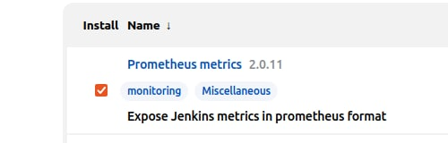
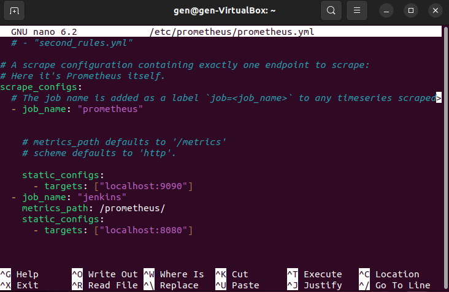
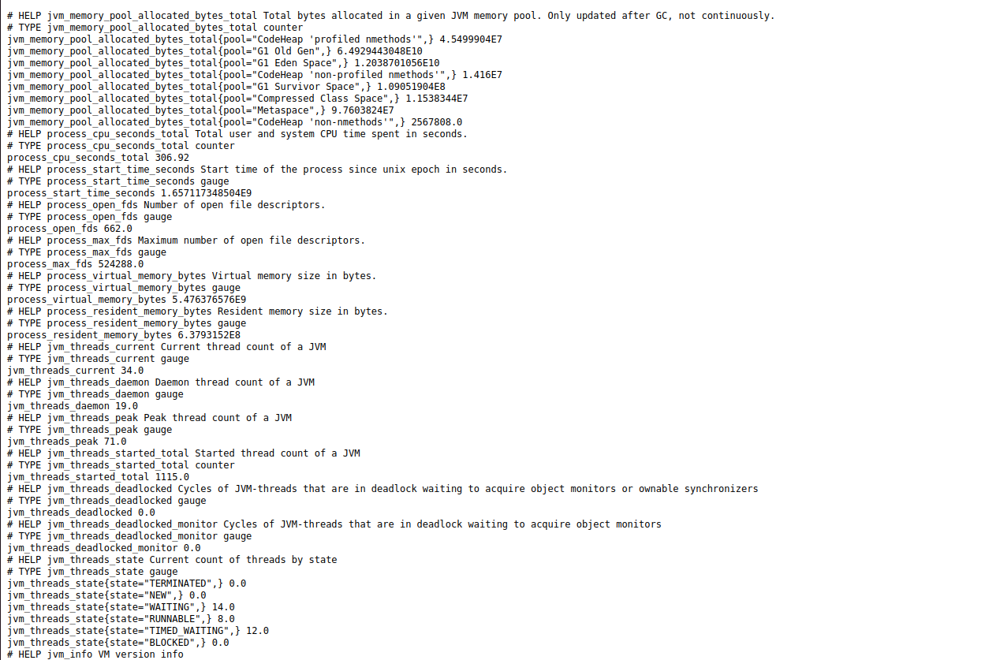
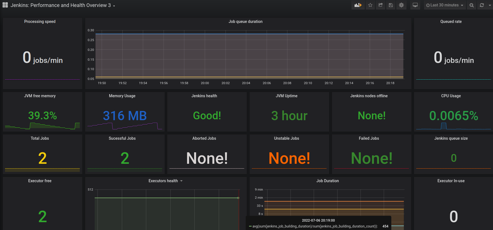

# Рrometeus + Grapha

один з етапів встановлення prometheus

Встановлення плагіну prometheus metrics в jenkins для роботи prometheus

прописуємо шлях для передачі логування від jenkins до prometheus

Логування від prometheus, для цього потрібно зайти на http://localhost:9090/prometheus/

І оці логи у нас перетворюються на ось такі гарненькі графіки

