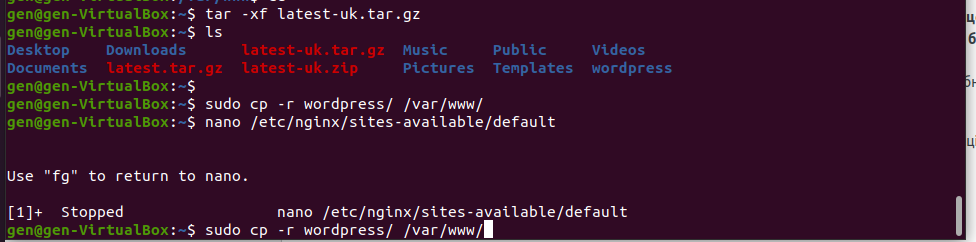
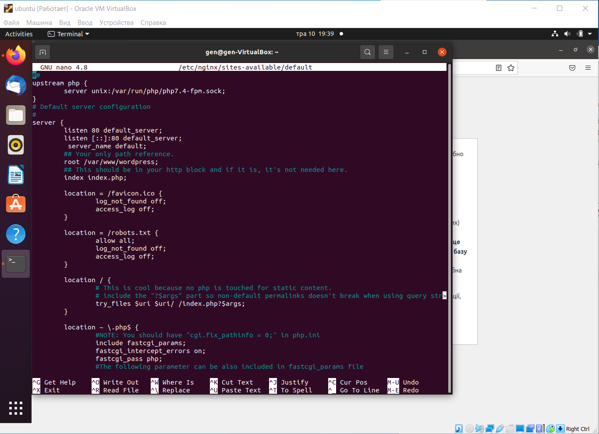
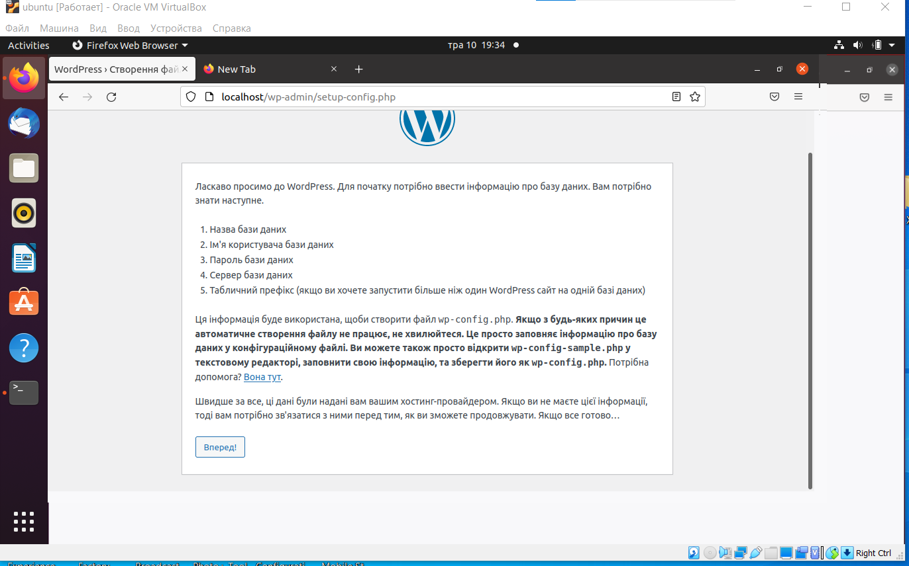
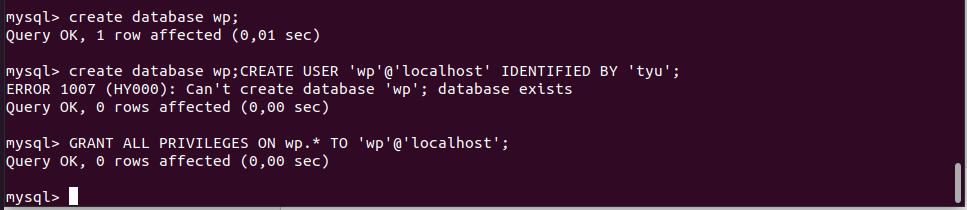
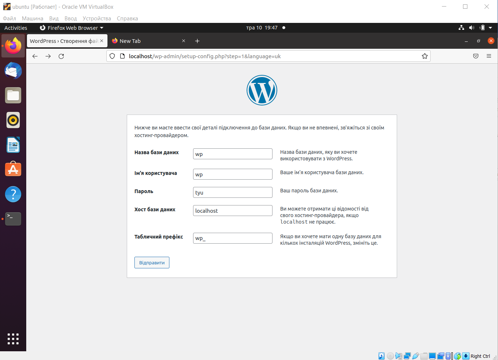
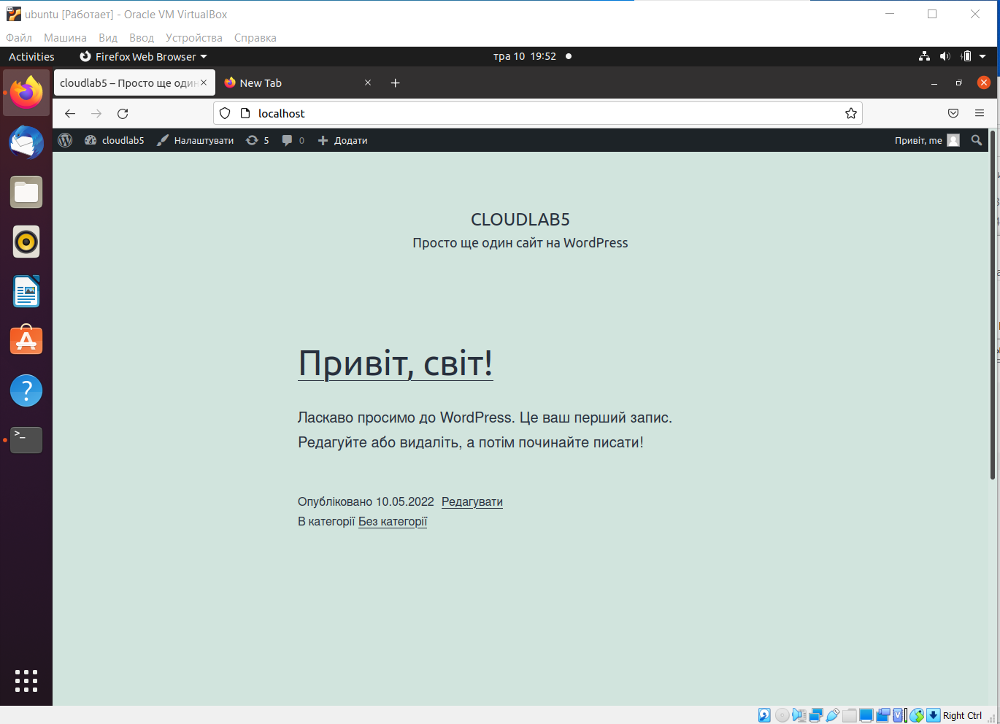

# Встановлення wordpress на nginx

Встановлення необхідних пакетів
~~~
sudo apt install nginx php-fpm php-mysql mysql-server mysql-client
~~~

Завантаження wordpress
~~~
wget https://uk.wordpress.org/latest-uk.tar.gz
~~~

Розпакування архіву
~~~
tar -xf latest-uk.tar.gz
~~~

Копіюжмо wordpress в робочу директорію
~~~
sudo cp -r wordpress/ /var/www/
~~~

Налаштуємо NGINX
~~~
nano /etc/nginx/sites-available/default
~~~
~~~
# Upstream to abstract backend connection(s) for php
upstream php {
        server unix:/var/run/php/php7.4-fpm.sock;
}

server {
        server_name default;
        root /var/www/wordpress;
        ## This should be in your http block and if it is, it's not needed here.
        index index.php;
        location = /favicon.ico {
                log_not_found off;
                access_log off;
        }

        location = /robots.txt {
                allow all;
                log_not_found off;
                access_log off;
        }

        location / {
                # This is cool because no php is touched for static content.
                # include the "?$args" part so non-default permalinks doesn't break when using query string
                try_files $uri $uri/ /index.php?$args;
        }

        location ~ \.php$ {
                #NOTE: You should have "cgi.fix_pathinfo = 0;" in php.ini
                include fastcgi_params;
                fastcgi_intercept_errors on;
                fastcgi_pass php;
                #The following parameter can be also included in fastcgi_params file
                fastcgi_param  SCRIPT_FILENAME $document_root$fastcgi_script_name;
        }

        location ~* \.(js|css|png|jpg|jpeg|gif|ico)$ {
                expires max;
                log_not_found off;
        }
}

~~~
Після конфігурації перезавантажуємо nginx
~~~
sudo service nginx restart
~~~
Вводимо в браузері localhost

Створення бази та користувача MySQL
~~~
create database wp;
CREATE USER 'wp'@'localhost' IDENTIFIED BY 'tyu';
GRANT ALL PRIVILEGES ON wp.* TO 'wp'@'localhost';
~~~

заносимо ці у вордпрес

І нарешті результат

