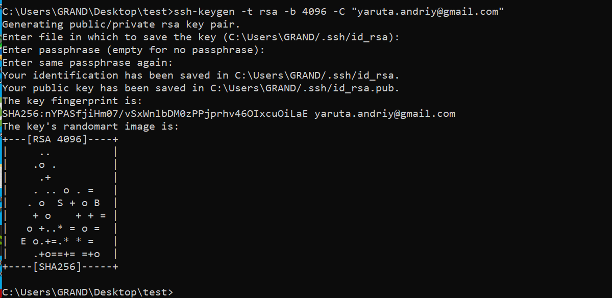
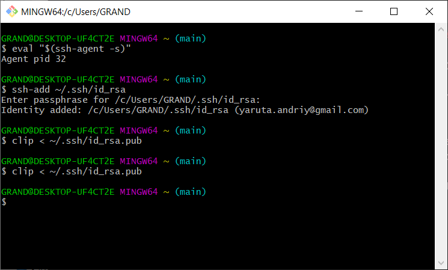
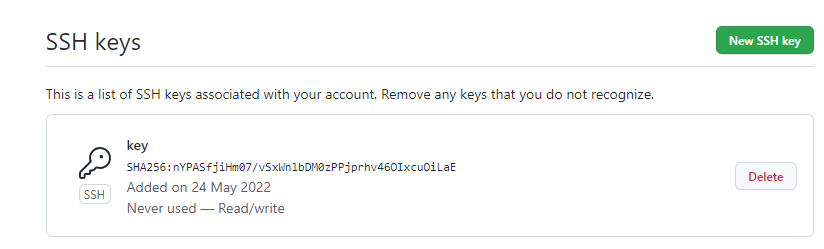
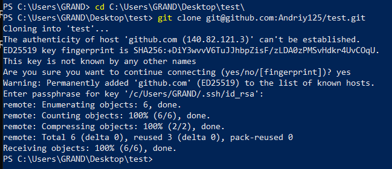
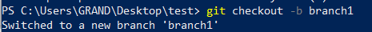
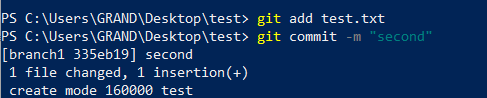
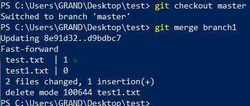

# Git, ssh та інше

створення ключа

Зчитування відкритого ключа

Успішне додавання ключа на github

Підключення до репозиторію через ssh

Створення нової гілки

Створюємо коміт з зміненим файлом в вітку branch1

об'єднуємо вітки

